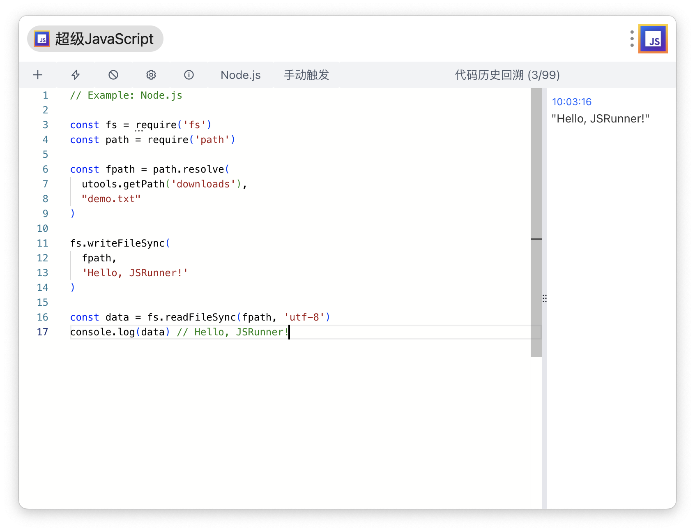

# JSRunner

[⭐️ 主页 | WebSite](https://ziuchen.github.io/project/JSRunner/)
[🕶️ 在线体验 | Online](https://ziuchen.github.io/JSRunner/)
[🚚 更新日志 | Changelog](https://ziuchen.github.io/project/JSRunner/log/)

- ✅ Run JavaScript code to quickly verify code logic
- ✅ Support switching NodeJS/browser operating environment
- ✅ `Ctrl/Command+R` Quickly run code
- ✅ `Ctrl/Command+Q` Clear the console
- ✅ `Ctrl/Command+N` Create new code snippet
- ✅ `Ctrl/Command+E` Toggle Lock status
- ✅ `Ctrl/Command+Shift+P` Call Command Palette
- ✅ `Ctrl/Command+Shift+L` List all history
- ✅ Support backtracking code history. Support saving/editing code running history
- ✅ Support manually triggering code execution/running code in real time
- ✅ Support top-level await. Adapt to dark mode

